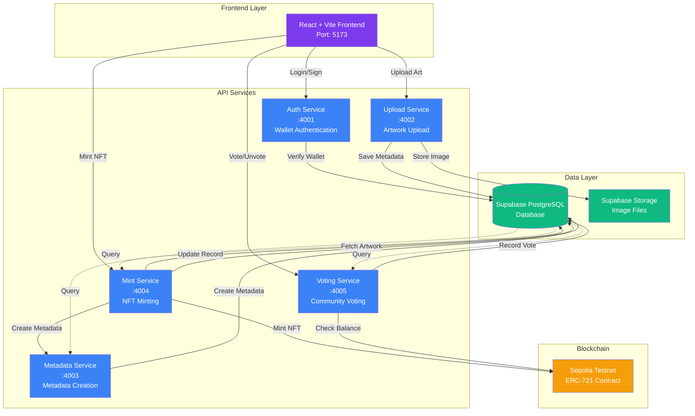
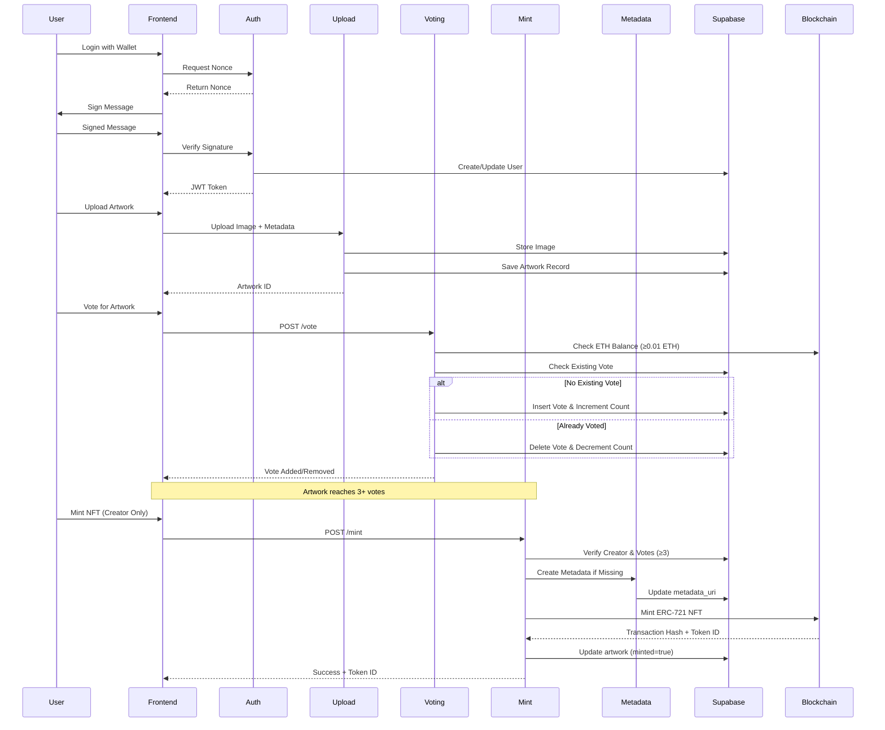

# Aetheria - Decentralized Art Museum

A microservices-based decentralized art museum platform that enables artists to upload digital art, mint NFTs on Sepolia, and showcase their work in a community-driven gallery. Artworks require community validation (3+ votes) before they can be minted as NFTs.

# Demo Video (screen recording)

https://github.com/user-attachments/assets/81f40737-f358-4fa5-bc57-7a7f058656c1

## 🏗️ Architecture

Aetheria is built as a microservices architecture with a React frontend and 5 independent backend services.



### System Flow



### Services Overview

| Service | Port | Responsibility | Key Features |
|---------|------|----------------|-------------|
| **auth-service** | 4001 | Wallet authentication | Nonce generation, signature verification |
| **upload-service** | 4002 | Artwork upload handling | Image upload, SHA-256 hashing, duplicate detection |
| **metadata-service** | 4003 | Metadata creation | JSON metadata generation, URI creation |
| **mint-service** | 4004 | NFT minting | ERC-721 minting, transaction handling |
| **voting-service** | 4005 | Artwork voting system | Vote/unvote, ETH balance check (≥0.01), vote persistence |

## ✨ Key Features

- **Community-Driven Curation**: Artworks need 3+ votes to become eligible for minting
- **Secure Voting**: Only wallets with ≥0.01 Sepolia ETH can vote
- **Persistent Votes**: Vote state saved in database, persists across sessions
- **One-Way Voting**: Once voted, users can unvote (vote toggle)
- **Creator Verification**: Only artwork creators can mint their pieces
- **Wallet Authentication**: Secure wallet-based login with signature verification
- **Provenance Tracking**: Complete history from upload → votes → mint
- **Featured Gallery**: Displays minted NFTs and top-voted artworks

## 🚀 Quick Start

### Prerequisites

- Node.js 18+
- Docker and Docker Compose
- Supabase account
- Sepolia testnet wallet with ETH (for voting: ≥0.01 ETH)

### Local Development

1. **Clone the repository:**
```bash
git clone https://github.com/yourusername/aetheria.git
cd aetheria
```

2. **Set up environment variables:**
```bash
cd infra
cp .env.example .env
# Edit .env with your configuration
```

Required environment variables:
- `SUPABASE_URL` - Supabase project URL
- `SUPABASE_SERVICE_ROLE_KEY` - Supabase service role key
- `RPC_URL` - Sepolia RPC endpoint (e.g., `https://rpc.sepolia.org`)
- `PRIVATE_KEY` - Wallet private key for minting
- `CONTRACT_ADDRESS` - Deployed ERC-721 contract address
- `MINTER_AUTH_TOKEN` - Secret token for mint service (optional)

3. **Initialize Supabase database:**
```bash
# Run the SQL schema in your Supabase SQL Editor
# Copy contents from scripts/init_supabase.sql
```

4. **Start services with Docker Compose:**
```bash
cd infra
docker-compose up -d
```

5. **Deploy smart contract to Sepolia:**
```bash
cd services/contract-service
npm install
npm run deploy:sepolia
# Copy the contract address to your .env files
```

6. **Start the frontend:**
```bash
cd frontend
npm install
npm run dev
# Frontend runs on http://localhost:5173
```

## 📁 Project Structure

```
aetheria/
├── frontend/              # React + Vite frontend application
│   ├── src/
│   │   ├── components/    # React components
│   │   ├── pages/        # Page components
│   │   ├── lib/          # Utilities (auth, API, wagmi)
│   │   └── styles/       # Global styles
│   └── package.json
├── services/              # Microservices
│   ├── auth-service/      # Wallet authentication (Port 4001)
│   ├── upload-service/    # Artwork upload handling (Port 4002)
│   ├── metadata-service/ # Metadata creation (Port 4003)
│   ├── mint-service/     # NFT minting (Port 4004)
│   ├── voting-service/   # Voting system (Port 4005)
│   └── contract-service/ # Smart contracts and deployment
├── infra/                 # Infrastructure configuration
│   ├── docker-compose.yml
│   └── README-deploy.md
├── scripts/               # Database and seed scripts
│   └── init_supabase.sql
└── README.md
```

## 🔐 Environment Variables

### Frontend (.env in frontend/)
```bash
VITE_API_BASE=http://localhost:4001
VITE_API_AUTH_BASE=http://localhost:4001
VITE_API_UPLOAD_BASE=http://localhost:4002
VITE_API_METADATA_BASE=http://localhost:4003
VITE_API_MINT_BASE=http://localhost:4004
VITE_API_VOTING_BASE=http://localhost:4005
VITE_SUPABASE_URL=your-supabase-url
VITE_SUPABASE_ANON_KEY=your-anon-key
VITE_ALCHEMY_URL=https://eth-sepolia.g.alchemy.com/v2/YOUR_KEY
VITE_WALLETCONNECT_PROJECT_ID=your-project-id
```

### Backend Services (.env in infra/)
```bash
# Shared
SUPABASE_URL=your-supabase-url
SUPABASE_SERVICE_ROLE_KEY=your-service-role-key

# Mint Service
RPC_URL=https://rpc.sepolia.org
PRIVATE_KEY=your-private-key
CONTRACT_ADDRESS=0x...
MINTER_AUTH_TOKEN=your-secret-token

# Voting Service (needs RPC for balance checking)
RPC_URL=https://rpc.sepolia.org
```

## 🔄 Core Workflows

### 1. User Authentication
- User connects wallet → Frontend requests nonce from auth-service
- User signs message → Frontend sends signature to verify
- Auth-service validates → Returns JWT token stored in localStorage

### 2. Artwork Upload
- User uploads image → Upload service computes SHA-256 hash
- Checks for duplicates → Stores in Supabase Storage
- Creates artwork record → Returns artwork ID

### 3. Community Voting
- User votes for artwork → Voting service checks:
  - Wallet has ≥0.01 Sepolia ETH
  - User hasn't already voted (or allows unvote)
- Vote persisted → Updates vote_count in database

### 4. NFT Minting
- Artwork reaches 3+ votes → Creator can mint
- Mint service:
  - Verifies creator identity
  - Checks vote count (≥3)
  - Creates metadata if missing
  - Mints ERC-721 NFT on Sepolia
  - Updates artwork record with token ID

## 🧪 Testing

Run tests for each service:
```bash
cd services/auth-service && npm test
cd services/voting-service && npm test
# etc.
```

### Quick Deploy Overview

1. **Supabase**: Set up database and storage bucket
2. **Smart Contract**: Deploy to Sepolia testnet
3. **Backend Services**: Deploy each service to Render/Vercel
4. **Frontend**: Deploy to Vercel with environment variables

## 🎯 Voting Rules

- **Minimum Votes**: 3 votes required for minting eligibility
- **Balance Requirement**: Voters must have ≥0.01 Sepolia ETH
- **Vote Persistence**: Votes stored in database, persist across sessions
- **Vote Toggle**: Users can vote and unvote (one vote per artwork at a time)
- **No Duplicate Votes**: Database constraint prevents double voting

## 🔗 Useful Links

- [Supabase Dashboard](https://supabase.com/dashboard)
- [Sepolia Etherscan](https://sepolia.etherscan.io/)
- [Vercel Dashboard](https://vercel.com/dashboard)
- [Render Dashboard](https://render.com/dashboard)

## 📄 License

MIT License
